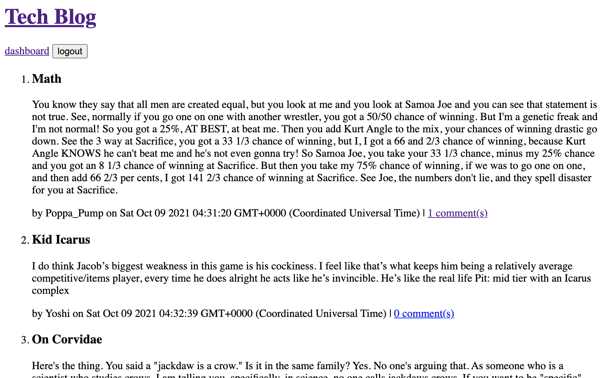

# Tech Blog Site

A blog site for multiple users with authentication and commenting

## Deployed Site on Heroku

https://vast-wildwood-26919.herokuapp.com/

## Features and Technologies

- MySQL database using Sequelize
- Express.js server
- Authentication using express-session
- Password hashing using bcrypt
- Components templated with Handlebars

## Future Development Plans

While the site is fully functional, some more attractive styling would greatly enhance it; so further development will likely focus on CSS.

## About the Programmer

Kat Dixon is a developing developer with interests in accessibility, security, and the intersections between the two.